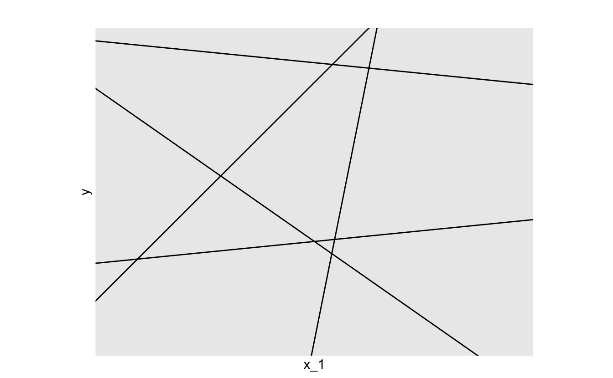
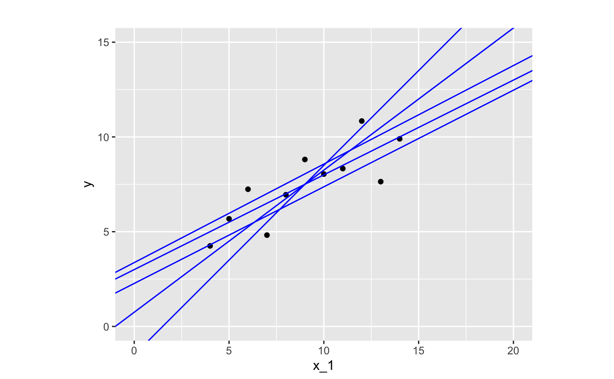
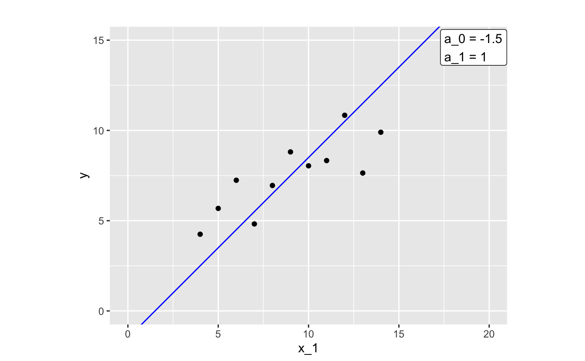
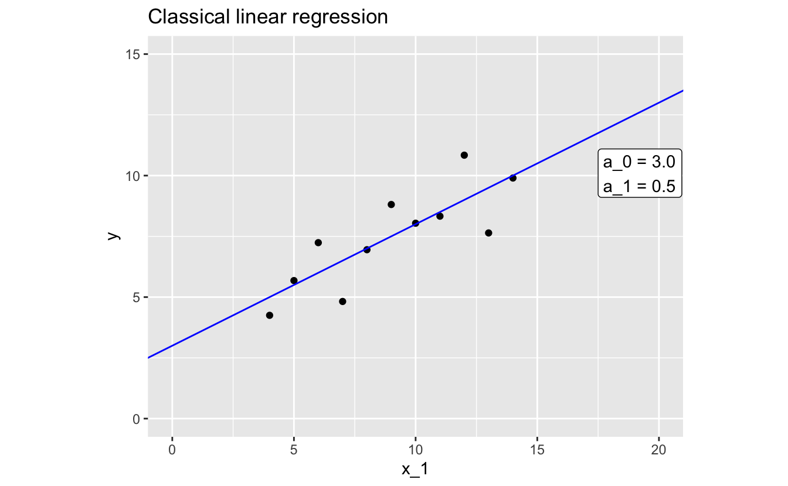

# Model basics

## What is a model?

The world is complicated and messy, and there are endless details to even simple phenomena. To understand and navigate the world, we construct and use models. 

For example, think about traffic. You probably have a simple mental model that says traffic will be worse at rush hour than at two in the morning. You can use this model to describe how traffic varies throughout the day, but you can also use it to predict the level of traffic at a given hour. 

Your mental model of traffic, like any model, is an approximation. It tries to capture relevant information while ignoring noise and less important details. Your traffic mental model will never fully explain traffic, and so you'll never be a perfect predictor of how many cars will be on the road at any given time. However, if it's a good model, it will be useful.

The type of models we'll discuss in this book are similar to your mental model of traffic: they are approximations; you can use them to both describe and predict the world; and, while they will never be completely accurate, they can be useful.

## Supervised learning

You can divide up the world of models into two categories: _supervised_ and _unsupervised_. In the following, we'll discuss supervised learning, but it's useful to understand the difference between the two. 

Supervised models are functions. They approximate the relationship of one variable to others. The variable you want to explain (e.g., traffic) is called the _response_ and the variables (e.g, time of day) you use to explain the response are called _predictors_. 

Unsupervised models don't have a response variable. Instead of trying to understand a relationship between predictors and a response, unsupervised models try to find patterns in data. 

When building a supervised model, your job as the modeler is to find a function that approximates your data. Functions map from one or more variables (e.g., time) to another (e.g., amount of traffic). You can use your approximation function to understand and describe your data, as well as make predictions about your response variable. 

There are an infinite number of types of functions, so how do you know where to look? The first step is to explore your data and determine which _function family_ (or families) would best approximate your data. Function families are sets of functions with the same functional form. In the next section, we'll talk more about the linear function family. Then, in Chapter 3, we'll discuss how to use exploratory data analysis to choose a function family to approximate your data. 

## Choosing a function family

[Anscombe's quartet](https://en.wikipedia.org/wiki/Anscombe%27s_quartet) is a set of four small data sets. In this section, we'll use a slightly modified version of the first data set in the quartet. 

| x_1|     y|
|---:|-----:|
|  10|  8.04|
|   8|  6.95|
|  13|  7.64|
|   9|  8.81|
|  11|  8.33|
|  14|  9.90|
|   6|  7.24|
|   4|  4.25|
|  12| 10.84|
|   7|  4.82|
|   5|  5.68|

Recall that we said the first step to fitting a model is to determine which function family best approximates your data. In modeling, some of the most common and useful function families are linear. There are an infinite number of linear function families and, later, we'll talk about how to decide exactly which family to use. For now, we'll introduce the family of linear functions of a single variable. Functions in this family take the following form:

`y = a_0 + a_1 * x_1` .

`x_1` is your input variable, the variable that you supply to the function in hopes of approximating some other variable. In our traffic example, `x_1` is the time of day.

`a_0` and `a_1` are the _parameters_. These two numbers define the line. The only difference between functions in the family of linear functions are their values of `a_0` and `a_1`.

To visualize this, here's a plot of many different lines, each of which has a different combination of `a_0` and `a_1`.

`a_0` defines the y-intercept, the y-value your function will produce when `x_1` is 0. `a_1` is the slope, which tells you how much `y` changes for every one unit increase in `x_1`. These two parameters define a linear function, and so to fit a linear model, you just have to determine which `a_0` and `a_1` best approximates your data.

As you'll learn in Chapter 3, visualization is crucial to determining functional form. Let's visualize the relationship between `x_1` (the predictor) and `y` (the response).

The relationship between `x_1` and `y` looks linear, so a function in the linear family will likely make a good approximation. There are infinitely many functions you could use.

Let's pick one function and take a closer look.

By glancing at the plot, you can tell that this function isn't doing the best job of approximating our data. Most of the points where `x_1 < 9` fall above our line, and most of the points where `x_1 > 9` fall below the line.

The distances between the line and each of the data points are called _residuals_ (or errors).

Each residual represents the actual value of `y` associated for a given `x_1` and the `y` value that the model predicts for that `x_1`. The larger a residual, the worse your model approximates `y` at that value of `x_1`.

We now turn to two methods for modeling your data, once you've chosen a function family with which to model.

## Classical modeling

Classical modeling finds the function in a function family for which the data would be most likely. For a linear function family, and with the assumption that the residuals are normally distributed with mean 0, this is equivalent to finding the function in the family that minimizes the sum of the squares of the residuals. In this case, the method is referred to as least squares regression.

The R function `lm()` fits linear models using classical least squares regression. `lm()` needs two arguments: a function family and your data. In later chapters, you'll learn how use `lm()`. For now, we'll just show you the results for our example data.

Here's the model that `lm()` came up with:

`y = 3.0 + 0.5 * x_1` .

And here's the model plotted with the data:

You can tell from the plot that this fitted model does a much better job of approximating our data than our previous attempt.

Again, `a_0` is the intercept, so we know that our model predicts that `y` will be 3.0 when `x_1` is 0. `a_1` is the slope, which means that our model predicts a 0.5 increase in `y` each time `x_1` increases by 1.

## Bayesian modeling

In addition to providing the parameters for a function from a function family, the Bayesian formulation provides an estimate of the parameters' probability distribution. This enables you to understand the uncertainties in the model and its predictions. Bayesian modeling also allows you to incorporate additional prior information into the modeling process.

The `stan_glm()` function in the [rstanarm](https://mc-stan.org/rstanarm/) package fits generalized linear models using Bayesian modeling. It needs two arguments: a function family and your data. In later chapters, you'll learn how use `stan_glm()`. For now, we'll just show you the results for our example data.

Here's the model that `stan_glm()` came up with:

`y = 3.0 + 0.5 * x_1` .
    
And here's the model plotted with the data:

`stan_glm()` provides distributions for the parameters `a_0` and `a_1`. The values above are the medians of these distributions. These values are very close to those returned by `lm()`. The joint distribution of the parameters and the standard deviation of the residuals allows us to express the uncertainties in the model and its predictions. Predictive uncertainties are shown in the grey ribbons in the plot.

## Summary

In this chapter, we went over the basics of a supervised model. Before you can fit a model, however, you first have to understand your data and check for any problems. The simple data used in this chapter doesn't measure anything real, but you'll typically be fitting models to complex, messy datasets. In the next chapter, we'll discuss how to use exploratory data analysis to understand and prepare your data before starting the modeling process.

