# Understand your data


```r
library(tidyverse)
```

The `diamonds` dataset, in the [ggplot2](https://ggplot2.tidyverse.org/) package, contains information on 53,940 round diamonds from the [Loose Diamonds Search Engine](https://www.diamondse.info). 

Each row of `diamonds` represents the features of a single diamond, including a set of characteristics called the four Cs: carat, clarity, color, and cut. 

Over the next several chapters, we'll model the relationship between the four Cs and diamond price, but before we dive into modeling, it's important to understand our data. In this chapter, we'll explore `diamonds`, visualize the important variables, look for errors and outliers, and create a dataset that is ready for modeling. 

## Understand your variables

### Read the documentation

When working with a new dataset, the first step is to read the documentation. `diamonds` is built into ggplot2 and you can find the documentation at `?diamonds`. The [Loose Diamonds Search Engine](https://www.diamondse.info), the original source, also contains helpful information about the variables.  

As we said earlier, diamonds have a set of features called the four Cs: carat, clarity, color, and cut. `diamonds` contains these four features, as well as information on price and dimension. Here's an overview of the different variables, obtained from the `?diamonds` page and the original website.

* `carat` is a measure of diamond weight. One carat is equivalent to 0.2 grams. 

* `clarity` refers to how clear a diamond is. Diamonds often contain imperfections like cracks or mineral deposits. The fewer and less noticeable a diamond's imperfections, the better its clarity. `clarity` contains 8 ordered levels, from "I1" (the worst) to "IF" (the best).

* `color` refers to the color of the diamond. Colorless diamonds are considered better than diamonds with a yellow tint. `diamonds` contains diamonds of 7 different colors, represented  by different letters. "D" - "F" diamonds are considered colorless, while "G" - "J" diamonds have a very faint color.

* `cut` refers to how a rough diamond is shaped into a finished diamond. Better cuts create more symmetrical and luminous diamonds. `cut` has 5 ordered levels: "Fair", "Good", "Very Good", "Premium", "Ideal".

* `x`, `y`, `z`, `depth`, and `table` are various measures of a diamond's size, in millimeters. 

### `glimpse()`

`glimpse()` returns a useful snapshot of a dataset. 


```r
glimpse(diamonds)
#> Rows: 53,940
#> Columns: 10
#> $ carat   <dbl> 0.23, 0.21, 0.23, 0.29, 0.31, 0.24, 0.24, 0.26, 0.22, 0.23, 0.…
#> $ cut     <ord> Ideal, Premium, Good, Premium, Good, Very Good, Very Good, Ver…
#> $ color   <ord> E, E, E, I, J, J, I, H, E, H, J, J, F, J, E, E, I, J, J, J, I,…
#> $ clarity <ord> SI2, SI1, VS1, VS2, SI2, VVS2, VVS1, SI1, VS2, VS1, SI1, VS1, …
#> $ depth   <dbl> 61.5, 59.8, 56.9, 62.4, 63.3, 62.8, 62.3, 61.9, 65.1, 59.4, 64…
#> $ table   <dbl> 55, 61, 65, 58, 58, 57, 57, 55, 61, 61, 55, 56, 61, 54, 62, 58…
#> $ price   <int> 326, 326, 327, 334, 335, 336, 336, 337, 337, 338, 339, 340, 34…
#> $ x       <dbl> 3.95, 3.89, 4.05, 4.20, 4.34, 3.94, 3.95, 4.07, 3.87, 4.00, 4.…
#> $ y       <dbl> 3.98, 3.84, 4.07, 4.23, 4.35, 3.96, 3.98, 4.11, 3.78, 4.05, 4.…
#> $ z       <dbl> 2.43, 2.31, 2.31, 2.63, 2.75, 2.48, 2.47, 2.53, 2.49, 2.39, 2.…
```

`glimpse()` shows us the number of diamonds (53,940) and variables (10), and a peek at the values in each column. We can also see the different variables types: double (`dbl`), ordered (`ord`), and integer (`int`). We'll talk more about variable type later on in this chapter. 

### `summary()`

`summary()` is another helpful overview function.


```r
summary(diamonds)
#>      carat             cut        color        clarity          depth     
#>  Min.   :0.20   Fair     : 1610   D: 6775   SI1    :13065   Min.   :43.0  
#>  1st Qu.:0.40   Good     : 4906   E: 9797   VS2    :12258   1st Qu.:61.0  
#>  Median :0.70   Very Good:12082   F: 9542   SI2    : 9194   Median :61.8  
#>  Mean   :0.80   Premium  :13791   G:11292   VS1    : 8171   Mean   :61.7  
#>  3rd Qu.:1.04   Ideal    :21551   H: 8304   VVS2   : 5066   3rd Qu.:62.5  
#>  Max.   :5.01                     I: 5422   VVS1   : 3655   Max.   :79.0  
#>                                   J: 2808   (Other): 2531                 
#>      table          price             x               y              z       
#>  Min.   :43.0   Min.   :  326   Min.   : 0.00   Min.   : 0.0   Min.   : 0.0  
#>  1st Qu.:56.0   1st Qu.:  950   1st Qu.: 4.71   1st Qu.: 4.7   1st Qu.: 2.9  
#>  Median :57.0   Median : 2401   Median : 5.70   Median : 5.7   Median : 3.5  
#>  Mean   :57.5   Mean   : 3933   Mean   : 5.73   Mean   : 5.7   Mean   : 3.5  
#>  3rd Qu.:59.0   3rd Qu.: 5324   3rd Qu.: 6.54   3rd Qu.: 6.5   3rd Qu.: 4.0  
#>  Max.   :95.0   Max.   :18823   Max.   :10.74   Max.   :58.9   Max.   :31.8  
#> 
```

Notice that there are no `NA`'s in the data (for non-character variables, `summary()` displays the number of `NA`s in each column, if any exist). 

Take a look at the minimum and maximum values for each variable. `carat` and `price` both cover a large range of values. `x`, `y`, and `z` all have 0 as a minimum value, even though it's impossible for a diamond to actually have a length, width, or depth of 0 mm. `y` and `z` also have very large maximums. We'll investigate these values in the next sections.

## Check for problems

`x`, `y`, and `z` all contain some suspicious values. There are diamonds with 0s for these dimensions, which is impossible. There are also diamonds with large, improbable dimensions. A diamond with a `y` (width) of 58.9 mm, or 2.32 inches, would be similar in size to [some of the largest diamonds in the world](https://en.wikipedia.org/wiki/Cullinan_Diamond#Diamonds_cut_from_the_Cullinan), and would surely cost more than \$18,000.

We should check how many diamonds have an `x`, `y`, or `z` of 0. 


```r
diamonds %>% 
  filter(x == 0 | y == 0 | z == 0) %>% 
  nrow()
#> [1] 20
```

Luckily, there are only 20 (out of over 50,000), so we can just remove them.


```r
df <-
  diamonds %>% 
  filter(x > 0, y > 0, z > 0)
```

Now, we can visualize the distributions to investigate the suspiciously high values. Boxplots are a good choice when you're looking for outliers.


```r
df %>% 
  ggplot(aes(x, factor(1))) +
  geom_boxplot() +
  scale_y_discrete(breaks = NULL, labels = NULL, name = NULL)
```

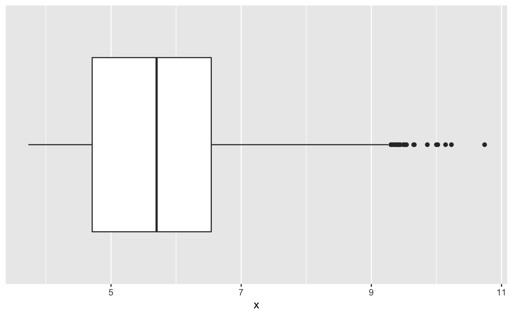

`x` has outliers, but they aren't very extreme. A diamond with an 10mm (0.39 in) length seems plausible.

How about `y` and `z`?


```r
df %>% 
  ggplot(aes(y, factor(1))) +
  geom_boxplot() +
  scale_y_discrete(breaks = NULL, labels = NULL, name = NULL)
```

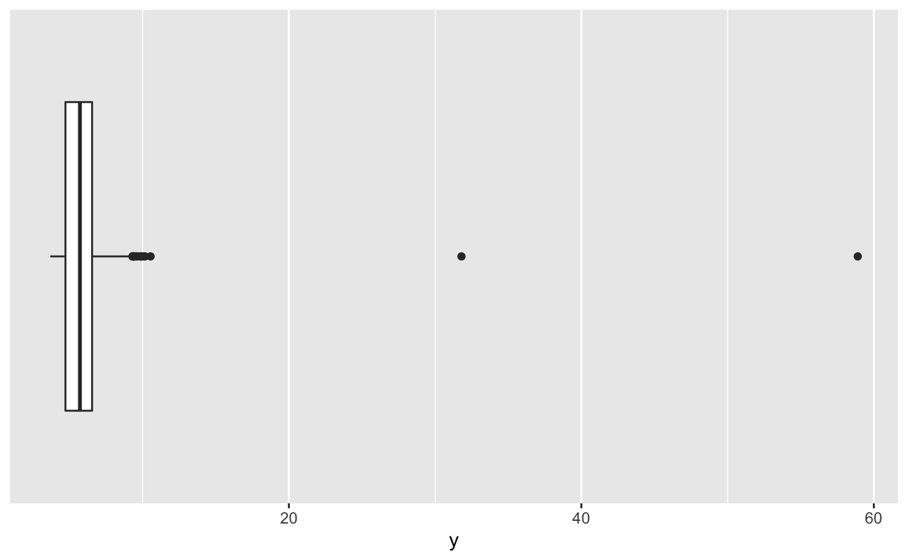


```r
df %>% 
  ggplot(aes(z, factor(1))) +
  geom_boxplot() +
  scale_y_discrete(breaks = NULL, labels = NULL, name = NULL)
```

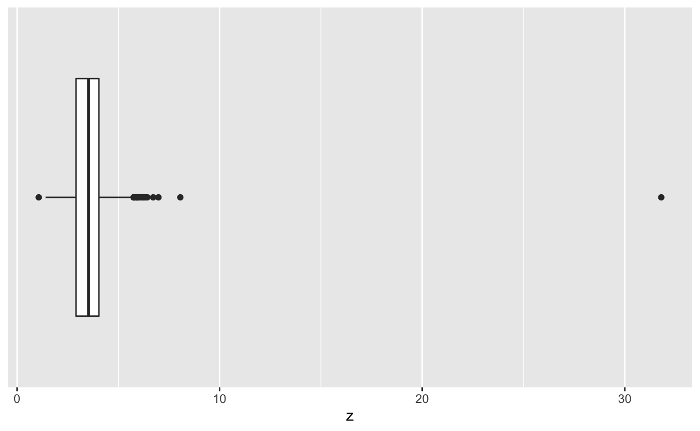

The large values of  `y` and `z` we saw in the `summary()` output are clearly extreme outliers. We'll remove these 3 diamonds. 


```r
df <-
  df %>% 
  filter(y < 20, z < 10)
```

We also noted that `carat` and `price` both cover a large range of values. We'll take a closer look in the next section.

## 1D EDA

Now that we've removed problematic data, we can explore each of our variables. One-dimensional exploratory data analysis or 1D EDA refers to the fact that, for now, we'll just look at each variable by itself. In the next chapter, we'll start exploring the relationships between variables. 

### Variable types

First, it's important to understand the difference between _continuous_ and _discrete_ variables. 

Continuous variables can take on an infinite number of possible values. `carat`, for example, is a continuous variable. A diamond can be 1.00 carats, 1.001 carats, 1.0001 carats, etc. R considers both integers and doubles to be continuous variables.

Discrete variables can take on only a finite number of possible values. In `diamonds`, `cut` is a discrete variable, as a diamond can be in only one of 6 different cut groups. 

Characters, logicals, and factors are discrete variables. R also further divides factors into ordered and unordered factors. Recall from the `glimpse()` output that `clarity`, `color`, and `cut` all have type `<ord>`, which indicates an ordered factor. As we'll explain later, many modeling algorithms treat ordered factors differently than unordered factors or character variables.

### Continuous variables

We'll use histograms to understand our continuous variables' distributions. First, let's look at `carat`.


```r
df %>% 
  ggplot(aes(carat)) +
  geom_histogram(binwidth = 0.01) 
```

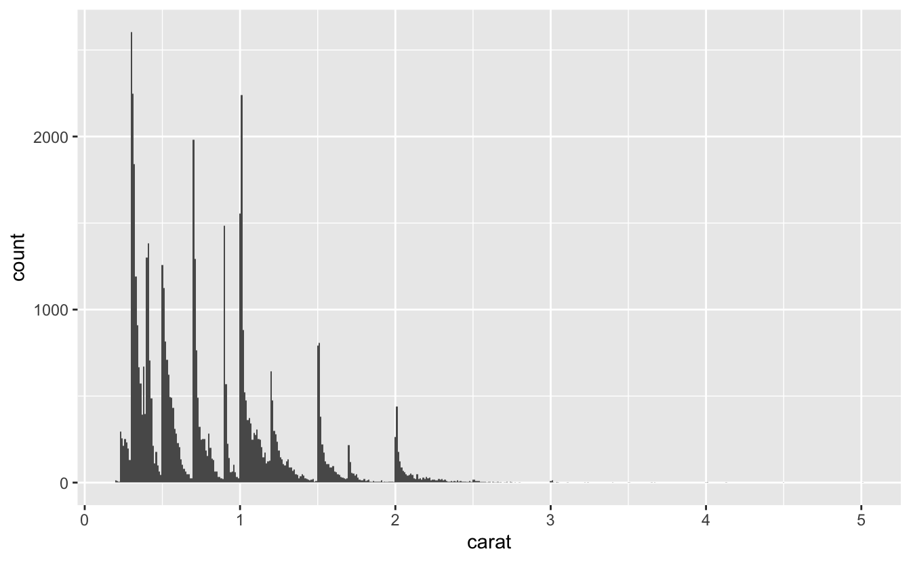

Earlier, we mentioned that `carat` has a large range. Our histogram makes it clear that the distribution has a very long tail. Most diamonds are under 2.5 carats, but the diamonds above 2.5 carats still account for over half of the range.

Building a model requires sufficient data. We can expect to build a fairly accurate model for the diamonds under 2.5 carats, but there aren't enough diamonds above 2.5 carats. These outlier, high-carat diamonds could distort our model, so we'll restrict our attention to 99% of the diamonds and ignore the largest 1%. 

99% of our diamonds are less than or equal to 2.18 carats. 


```r
quantile(df$carat, probs = 0.99)
#>  99% 
#> 2.18
```

We'll filter `df` to exclude diamonds above the 99% quantile.


```r
df <- 
  df %>% 
  filter(carat <= quantile(df$carat, probs = 0.99))
```

Now that we've focused the data, let's visualize the distribution again.


```r
df %>% 
  ggplot(aes(carat)) +
  geom_histogram(binwidth = 0.01)
```

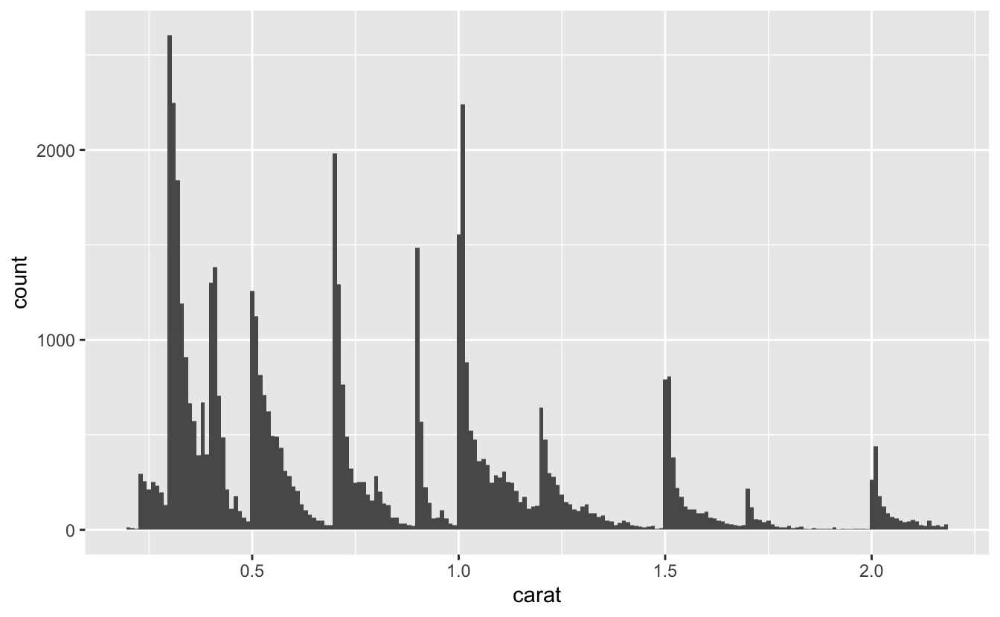

Notice the spikiness of the distribution. It will be easier to tell where these spikes are if we add more x-axis breaks. 


```r
df %>% 
  ggplot(aes(carat)) +
  geom_histogram(binwidth = 0.01) +
  scale_x_continuous(breaks = seq(0.2, 2.2, 0.1), minor_breaks = NULL)
```

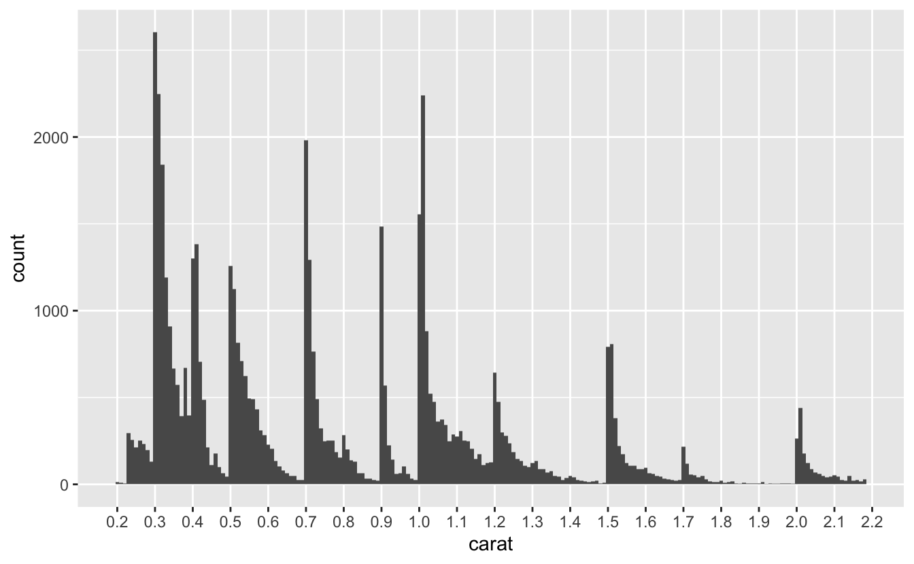

The spikes appear at or slightly above the even sizes of 0.3, 0.4, 0.5, 0.7, 0.9, 1.0, 1.2, 1.5, 1.7, and 2.0 carats. The diamonds in `diamonds` are cut from raw diamonds, so these spikes suggest that diamonds tend to be marketed at these sizes. Engagement rings, for example, tend to be around 1 carat, which could explain that spike.  

Now, let's look at price.


```r
df %>% 
  ggplot(aes(price)) +
  geom_histogram(binwidth = 50)
```

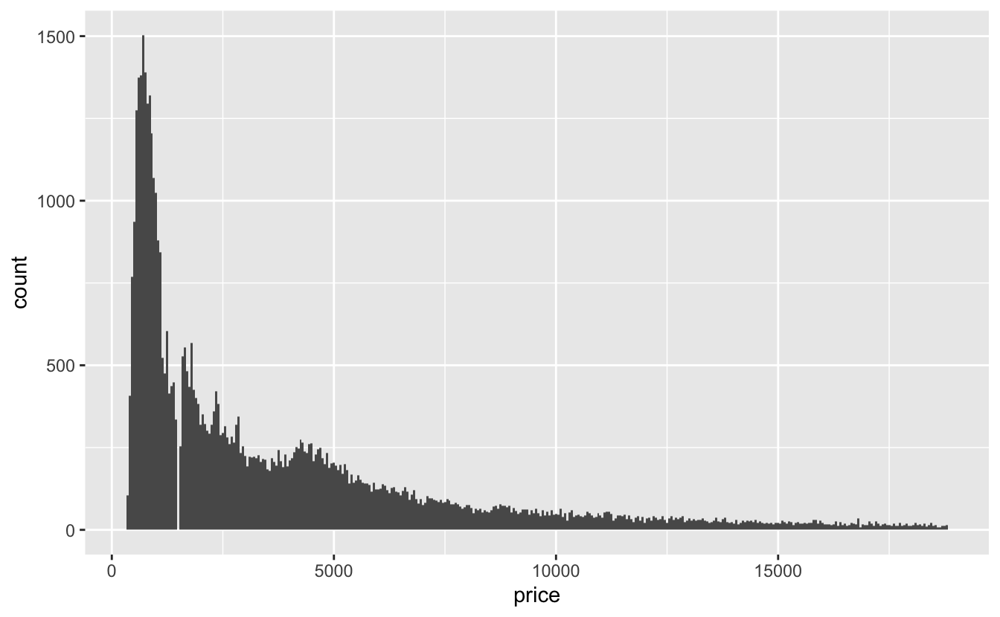

The `price` distribution also has a long tail, even though we've filtered out the largest diamonds. Interestingly, there's a gap in the distribution around \$1,500, probably caused by an error importing the data. 

With simple 1D EDA, we can already draw a conclusion for modeling this data. Notice how the `price` distribution doesn't follow the same spiky pattern as the `carat` distribution, suggesting that `price` is not just a simple linear function of `carat`. We'll come back to this idea in the next chapter. 

### Discrete variables

Now, we can turn to the discrete Cs: `clarity`, `color`, and `cut`. For discrete variables, we'll use `geom_bar()`.


```r
plot_bar <- function(var, data = df) {
  data %>%
    ggplot(aes({{ var }})) +
    geom_bar() 
}

plot_bar(clarity)
```

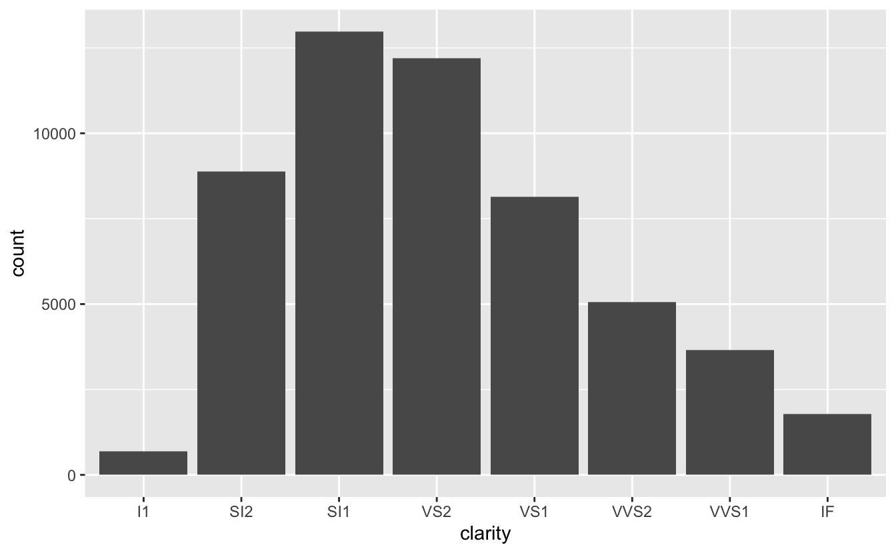

The best clarity classes are relatively rare, and most diamonds are in the SI1 category, the third worst. There are also very few diamonds with the worst clarity, I1. 


```r
plot_bar(cut)
```

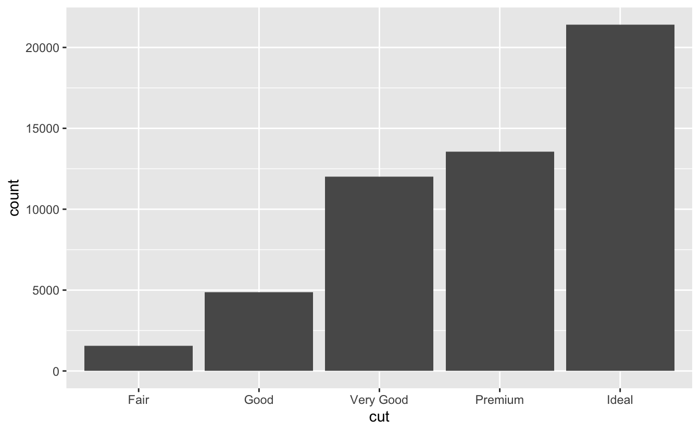

Interestingly, `cut` is very different. Ideal cut diamonds are very common, and the number of diamonds in each category increases as quality increases. Maybe `cut` is a feature that diamond manufacturers have more control over, whereas clarity is more a feature of the raw diamond.

The factor levels of `clarity` and `cut` are both in ascending order of quality, but `color` is in descending order. 


```r
plot_bar(color)
```

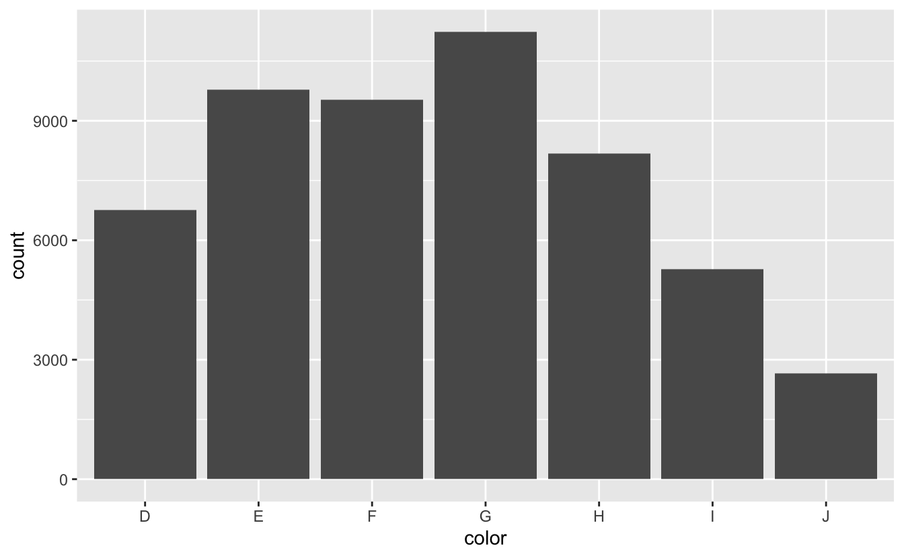

D is the best color and J is the worst. To transform `color` into ascending order, we can use `fct_rev()` to reverse the order of the factor levels.


```r
df <-
  df %>%
  mutate(color = fct_rev(color))
```

Now, `color` will plot in ascending order.


```r
plot_bar(color)
```

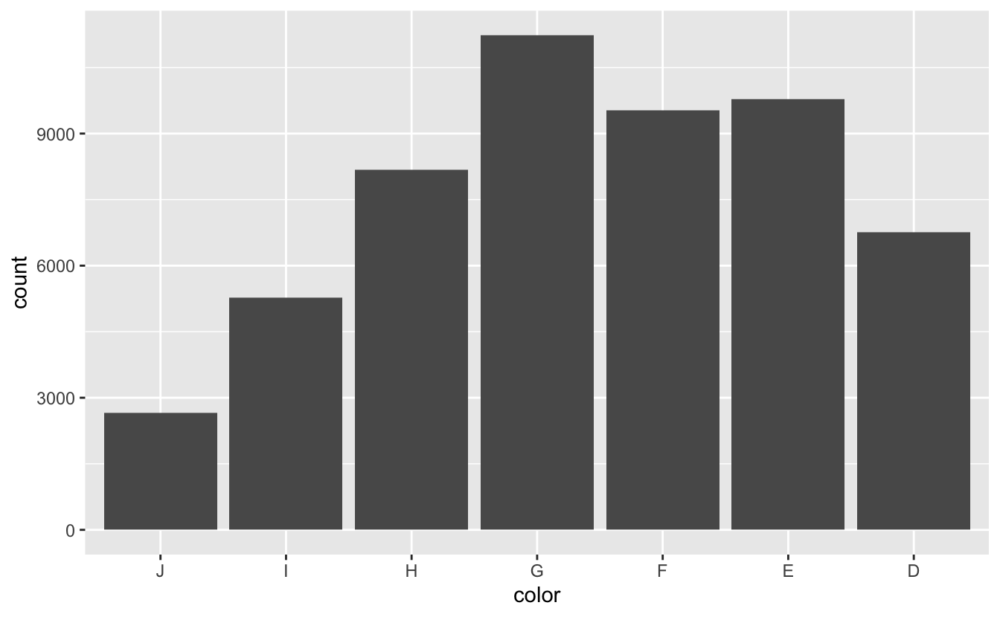

The most common color is G, which is in the middle of the distribution. There are more diamonds in the top half of the distribution than in the bottom.

## Summary

Before constructing a model, take the time to explore and understand your data. It's easier to build a good model if you understand what your variables actually measure, and it's important to check for errors that need to be removed. You may also, like we did, want to filter your data to focus on where most of the data lies. Otherwise, you might end up building a model heavily influenced by outliers. 

In the next chapter, we'll continue our EDA of `diamonds` in preparation for modeling by examining the relationship between the four Cs and `price`. 
